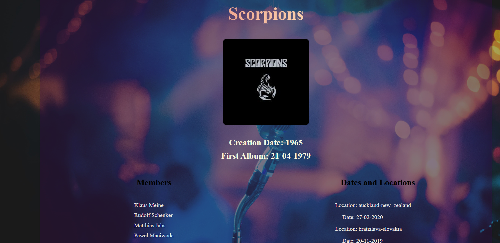

# groupie-tracker

**Groupie Tracker** is a web application that displays band and concert information using data from a provided API. The application allows users to explore artist profiles, concert locations, dates, and other related details through a user-friendly interface with various data visualizations.

## Features

- Display information about bands and artists (name, image, first album date, members, etc.).
- Show concert locations and dates for upcoming and past events.
- Visualize data using cards, tables, lists, and other components.
- Create and visualize events/actions triggered by the user (e.g., requests to fetch more data from the server).

## Usage

Once the server is running, navigate to `http://localhost:8080` (or the relevant port) in your web browser to see the band and concert data.

### Example Endpoints

- `/artists`: Returns a list of artists and their information.
- `/locations`: Provides concert location data.
- `/dates`: Lists upcoming and past concert dates.

## Authours 

1- Duaa AlMahal (dalmahal)

2- Mariam Adel (maadel) https://github.com/MariamAdel9

3- Qassim Zuhair (qzuhair)
